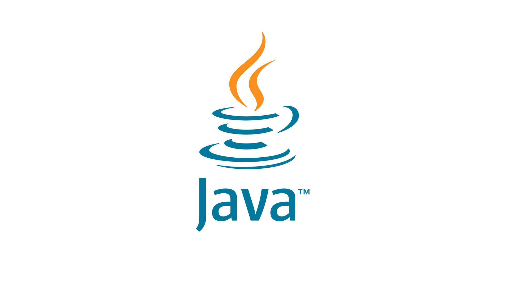

# Привет, меня зовут Александр! 👋

  

  

## 🚀 Обо мне

Я занимаюсь русификаций китайский автомобилей,переводом,адаптацией под Российский рынок с начала 2024 года.
Моя делятельность связана с android os и apk file,работа с файловой системой Андройда и замена ресурсов apk файлов и редоктирование кода.

- 🔭 Сейчас работаю над: Geely Manjaro 2025
- 🌱 Сейчас изучаю: Android developer
- 👯 Ищу сотрудничества в: Русификация китайских авто
- 💬 Спросите меня о: О перепрошивке и разработке прошивок на авто
- 📫 Как связаться: email aleksperdev@gmail.com tg @AleksAndroidDev
- 😄 Местоимения: Санкт - Петербург
- ⚡ Интересный факт: Ездил на самой быстрой машине в мире.

## 🛠 Технологии и инструменты

## 📈 Моя статистика GitHub

  
  

## 🌐 Социальные сети

tg @AleksAndroidDev

